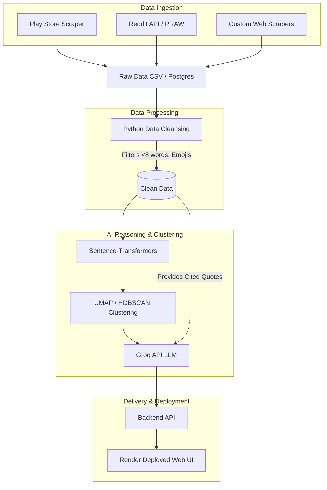

# System Architecture: AI-Powered Discovery Engine (Swiggy Instamart)

## Overview
This document outlines the high-level architecture for the **Part 1 AI-Powered Discovery Engine** designed to analyze user feedback and target "Category Inertia" on the Swiggy Instamart platform. The architecture is modular and uses a Python-native stack designed for high-speed local/cloud deployment on **Render**.

---

## 1. Data Ingestion Layer
The Ingestion Layer is responsible for aggregating unstructured data from various external sources using Python scripts.

- **App & Play Store**: Uses the `google-play-scraper` (Python) to pull user reviews at a scheduled frequency.
- **Reddit & Community**: Uses `praw` (Python Reddit API Wrapper) to extract discussions regarding quick-commerce and Swiggy Instamart.
- **Product Reviews & Forums**: Custom Python scrapers (e.g., BeautifulSoup) to extract data from independent product review sites.
- **Raw Data Storage**: The raw data is saved into local structured CSV files (`data/raw_reviews.csv`) or a lightweight Postgres instance on Render to ensure highly reliable offline processing.

## 2. Data Processing & Normalization Layer
This layer cleans the raw data and prepares it for AI analysis.

- **Data Cleansing Script**: 
  - Removes noise (e.g., reviews < 8 words, emoji-only responses).
  - Filters out non-English text.
  - Normalizes text (lowercasing, removing special characters where necessary).

## 3. AI Reasoning & Clustering Layer
The core intelligence of the system, responsible for making sense of the feedback using the Groq API and semantic clustering.

- **Embedding Generation**: Uses local `sentence-transformers` models to convert text into vector representations.
- **Clustering Engine**: Uses `umap-learn` and `hdbscan` to group similar vectors and identify recurring "habit traps" and "discovery barriers" without LLM hallucinations.
- **LLM Orchestrator (Groq API)**: 
  - Feeds the clustered text data into an LLM (e.g., Llama 3 on Groq for ultra-fast inference).
  - Prompts the LLM to answer the core strategic research questions (e.g., *Why do users repeat purchases? What role do habits play?*).
  - Ensures **Auditability** by instructing the LLM to cite its sources and linking generated themes directly back to the original raw quotes.

## 4. Delivery Layer (Deployed via Render)

- **API Layer**: FastAPI handles the routing between the JSON backend and the frontend.
- **Web UI / Dashboard**: A web application (e.g., FastAPI backend with a lightweight frontend) **deployed on Render**. This serves as the presentation layer to validate and demonstrate the engine's insights.

---

## Architectural Diagram (Conceptual Workflow)

